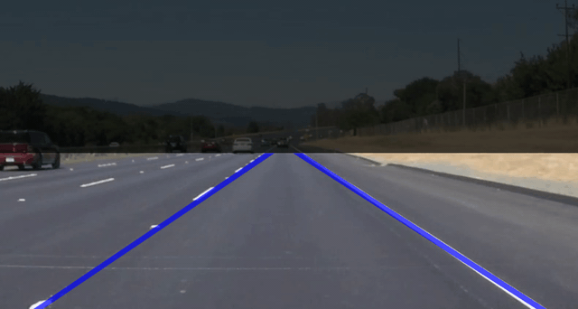
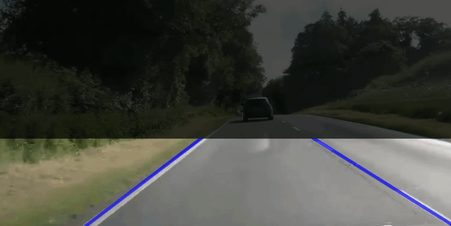

# Project Basic Lane Finding 

This project is just a self-learning experience by implementing in C++14 an 
algorithm similar to this
 [Udacity project](https://github.com/ndrplz/self-driving-car/blob/master/project_1_lane_finding_basic/).

Demo on straight road [videoclip](https://www.youtube.com/watch?v=mbqWboRy95Q):

Demo on cornering road [videoclip](https://www.youtube.com/watch?v=qCyg2w0ElU4):

## Prerequesites
1. gcc/clang, cmake
2. Install OpenCV `chmod +x ./ci/install_opencv.sh && ./ci/install_opencv.sh` 
3. Install  Boost `sudo apt-get install libboost-all-dev`

## Basic Build Instructions
1. Clone this repo `git clone https://github.com/huuanhhuynguyen/basic_lane_finding.git`
2. Make a build directory: `mkdir build && cd build`
3. Compile: `cmake .. && make`
4. Run it: `./basic_lane_finding_cpp`

## Run Unit Tests
1. Clone google test `git clone https://github.com/google/googletest tests/googletest/ tests/googletest/`
2. In the build/ directory, build the test `cmake .. -DBUILD_TEST=ON && make`
3. Run all tests `./tests/gtest_run`

## Explanation

The implementation can be seen in `src/main.cpp` with the following steps:

1. Read in image as RGB
2. Apply Gaussian blur
3. Apply a region of interest (ROI)
4. Apply Hough line detection
5. Transform Hough line to Cartesian line (with slope and bias)
6. Filter lines based on slopes
7. Separate into left and right lines based on slopes
8. On left lines, get the median line
9. On right lines, get the median line.
10. Apply moving average on each left and right line
11. Visualize